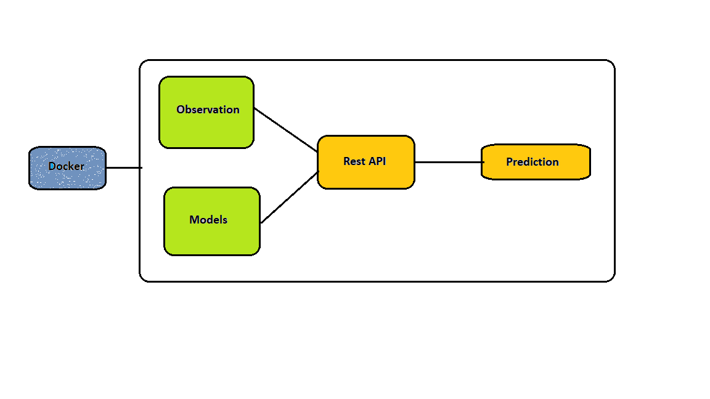

# Price_prediction with docker

## 📖 Table of Contents
1. [Introduction](#introduction) 📌 
2. [Description](#description) 📜 
4. [Installation](#installation) 🔧 
5. [Usage and Results](#usage) 🎮 
6. [Completion](#completion) 🏁 

## 📌 Introduction
This project @ BeCode.org as part of the AI Bootcamp in Gent aims at providing prediction in Rest API which runs inside docker and also locally.

## 📜 Description
* This project is based on collecting data from 10,000 houses.
* Clean and Analyse the data.
* Based on the data predict price value of new house 

## 🔧 Installation

* clone this repository
* use `pip install <module name>` to install the required models (or)
* use `Dockerfile` to install and create new image and run a container.

## 🎮 Usage and Results 📊  
### Locally
* open the terminal and redirect to where your repository is.
* run the server with `uvicorn app:app --reload`. whereas `app:` is the name of `.py` file and `:app` is the name of initialisation of `FastAPI`.
* now open `127.0.0.1:8000` to see welcome page and `127.0.0.1:8000/docs` to go to prediction page.
* follow the instructions in schema to enter the details to get the prediction.

### Docker deployment - with Docker
I was able to create docker image of size 1.82GB and run docker container to get the same result as my local machine. attaching dockerfile to the repository. 

* dowload and install [docker desktop](https://www.docker.com/) in your machine.
* open terminal and redirect to folder where your 'dockerfile' is.
* type `docker build -t <image_name> .` to create a docker image.  (please wait for sometime to create an image)
* type `docker run -p 8000:8000 --name <container_name> <image_name>` to create new container and run it.
* now open `127.0.0.1:8000` to see welcome page and `127.0.0.1:8000/docs` to go to prediction page. 
* follow the instructions in schema to enter the details to get the prediction.

## 🏁 Completion  
Name - Mythili Palanisamy  
Submission - 28/07/2023 4:00 PM  
Team type - solo
